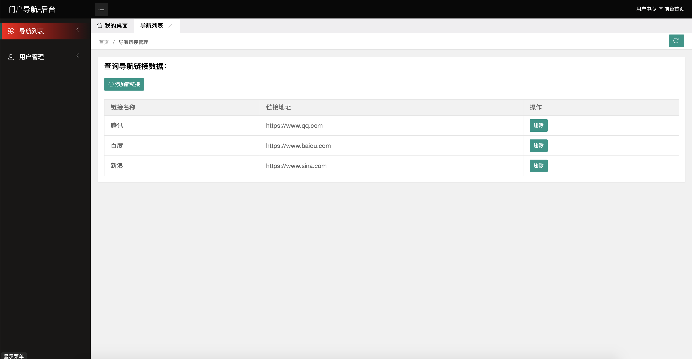
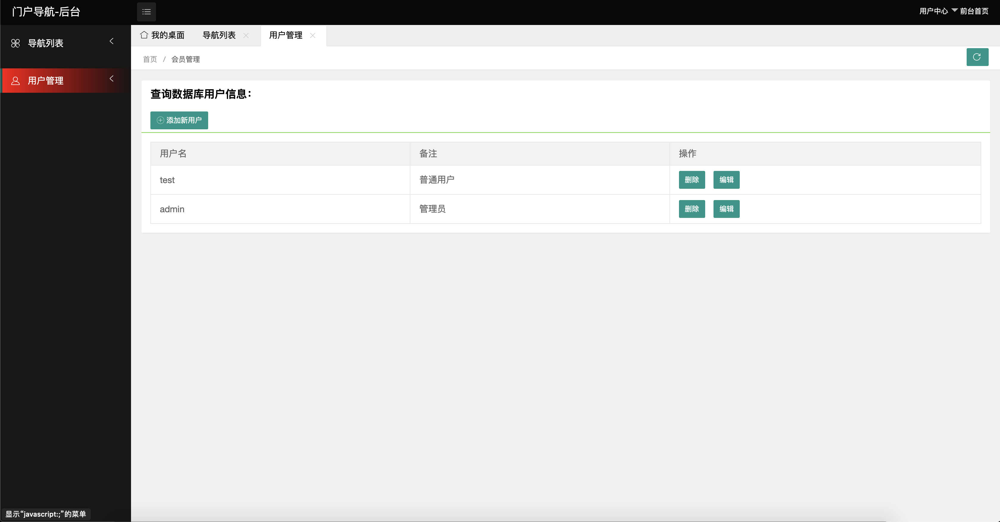
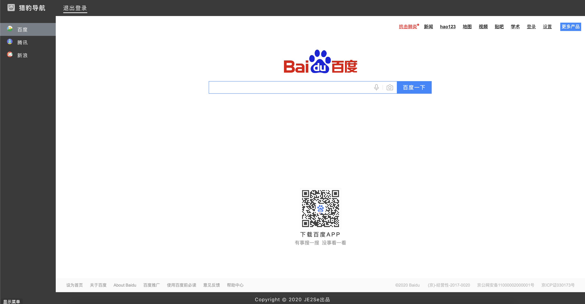

# 介绍

本版本为iframe版本。嵌套界面，被嵌套网站需自行配置跨域

# JE2Se_Nav

说明地址：https://www.je2se.com/archives/596    好评Star

## 使用方法

python3 manage.py runserver

## 说明

本页面设计之初仅为设计一个导航页面，带后台的导航界面，用了django框架，python3编写。

## 需求

因为页面开放在外网，所以增加了认证功能，首先通过认证才能到达导航页面； 
后台只有两个功能，一个是添加用户，一个是增加链接; 
用户分为管理用户以及普通用户，在登录页面普通用户登录直接跳转导航页面，管理员登录跳转后台界面 

## 更新说明

前端换了一套页面

## 截图

### 登录页面

### 管理员界面

### 普通用户界面

### 标签界面

